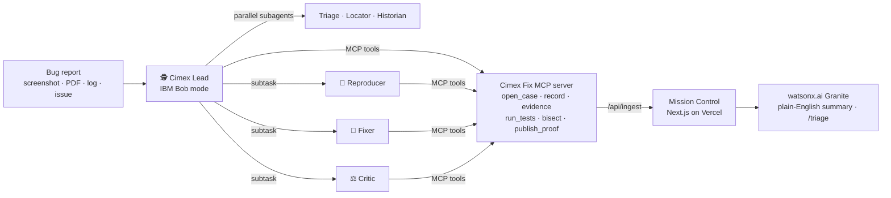

# Cimex Fix

**No fix without proof.**

Cimex Fix turns a bug report into a **Proof of Fix**. IBM Bob reproduces the bug with a failing test, pins the
culprit commit with `git bisect`, fixes it under file-level permissions, and an adversarial Critic signs off —
while **Mission Control** shows the whole investigation live.

- **Live site:** https://cimex-fix.vercel.app
- **A real Proof of Fix:** https://cimex-fix.vercel.app/cases/case_20260926_7e5e/proof
- **Results:** https://cimex-fix.vercel.app/impact · raw numbers in [`docs/benchmark.md`](docs/benchmark.md)
- **Demo target repo:** https://github.com/GegarinSagolsem/bugproof-demo-shoplite

Built for the IBM Bob 2.0 hackathon (lablab.ai). *Cimex* is the Latin genus of the bed bug. The project was first
called BugProof, so the demo repo, the `bugproof` MCP server and the Bob mode IDs still use that name.

---

## The problem

- **AI fixes are "almost right".** In Stack Overflow's 2025 survey, 66% of developers named "AI solutions that are
  almost right, but not quite" as their top frustration, and 45% said debugging AI-generated code takes longer.
- **Debugging is most of the job.** A 2013 Cambridge study estimated developers spend about half their programming
  time finding and fixing bugs.
- **Reviewers get a patch, not proof.** A PR that says "fixed the NaN total" rarely shows a test that failed before
  and passes after, the commit that caused it, or what else it could break.

Sources, exact quotes and caveats: [`docs/sources.md`](docs/sources.md).

## What Cimex Fix does

Drop a bug report into IBM Bob and pick the **🕵️ Cimex Lead** mode:

| # | Step | Who (Bob mode / tool) | What it may touch |
|---|---|---|---|
| 1 | **Report in** — screenshot, QA PDF, server log or issue text | Lead | only `.bugproof/` |
| 2 | **Investigate in parallel** — what broke, where the code runs, what changed recently | Triage · Locator · Historian subagents | read-only |
| 3 | **Reproduce (RED)** — the smallest test that fails on an assertion, not a crash | 🧪 Reproducer | only `tests/bugproof/*.test.ts` |
| 4 | **Pinpoint** — `git bisect` runs that test through history and names the culprit commit | Cimex Fix MCP server | temporary worktree |
| 5 | **Fix (GREEN)** — the smallest change that turns the test green without breaking any other test | 🔧 Fixer | only `src/**/*.ts` — tests are read-only |
| 6 | **Challenge** — adversarial review of edge cases and side effects; can send the fix back once | ⚖️ Critic | nothing (read-only) |
| 7 | **Proof** — a shareable Proof of Fix; IBM watsonx.ai Granite explains it in plain English | Lead + watsonx.ai | — |

Every step is recorded as evidence on the case, so the Proof of Fix page is built only from what actually happened.

## Results — 8 real bugs

From [`docs/benchmark.md`](docs/benchmark.md) (generated from the case events and Bob's task log; do not quote
numbers that aren't there):

| Metric | Result |
|---|---|
| Bugs attempted / proven | **8 / 8**: every planted bug (0 unproven) |
| Culprit commit matches the answer key | **8/8** — 7 pinned by `git bisect`, 1 named by the Historian from git history |
| Culprit named correctly *during* the run | 4/8 — the rest were confirmed by a follow-up bisect (see below) |
| Median time to a failing (RED) test | **4m 02s** |
| Median time to proof | 13m 45s (fastest 7m 40s; includes time runs waited on a human) |
| Run after the pipeline fixes (bug #5) | culprit by bisect at 4m 01s, **proven at 7m 44s**, 0 human prompts |
| Runs with zero human prompts | 6/8 |
| Bobcoins per fix | median 2.93 (range 2.39–5.36) |
| Largest test suite in a run | 120 tests, all passing |

| Bug | Arrived as | Time to proof | Culprit commit (found) |
|---|---|---|---|
| #4 Pagination drops the last product | issue text | 14m 39s | `882203d` refactor(catalog): compute pagination bounds explicitly |
| #6 Negative quantity accepted | server log | 7m 40s | `c3fb68f` refactor(cart): accept numeric strings for quantities |
| #1 Empty coupon field → total shows ₹NaN | screenshot | 21m 06s | `c3f394a` refactor(coupons): extract coupon rule parser |
| #3 Delivery date one day early after 8 PM IST | PDF (QA report) | 43m 49s | `b4369d9` perf(delivery): compute IST date without Intl.DateTimeFormat |
| #8 Coupon applies twice → discount over 100% | screenshot | 34m 01s | `185f248` feat(cart): allow stacking multiple coupon codes |
| #5 Search became case-sensitive | issue text | 7m 44s | `649b24a` perf(catalog): memoize search index |
| #7 Double-click "Place order" → two orders | issue text + log | 8m 02s | `985e247` refactor(orders): derive duplicate-order check from order history |
| #2 Totals off by ₹0.01 | issue text | 12m 51s | `98e2fce` feat(cart): sum multiple line items in cart totals |

### Compared with one-shot models

We gave five models on IBM watsonx.ai one answer per bug. Each got the report, every file under `src/` and the git
history, and had to name the culprit and return a fix and a test. One script ([`scripts/model-baseline.mjs`](scripts/model-baseline.mjs))
scores their answers and Bob's committed fixes the same way. The answer key's independent probe decides "fixed"; "fix
with proof" also needs every existing test green and the contender's own test failing before its fix and passing after.

| Contender (8 bugs) | Fixed | Fix with proof | Culprit correct |
|---|---|---|---|
| **Cimex Fix (IBM Bob)** | 8/8 | **8/8** | 8/8 (4/8 during the run) |
| gpt-oss-120b | 8/8 | **8/8** | 6/8 |
| Llama 4 Maverick | 5/8 | 3/8 | 4/8 |
| Mistral Small 3.1 | 5/8 | 2/8 | 5/8 |
| Llama 3.3 70B | 4/8 | 2/8 | 6/8 |
| Granite 4 H Small | 2/8 | 1/8 | 0/8 |

All 40 one-shot answers named a culprit and returned a fix and a test; 24 fixed the bug, 16 came with a test that
proves it, and 5 broke existing tests. The best model matched Cimex Fix, but only running the checks tells you which
answer that is. The models were handed all the code, while Bob started from the report alone; each model gave one
answer at temperature 0. Prompts, raw answers and caveats: [`docs/benchmark.md`](docs/benchmark.md#compared-with-one-shot-models-ibm-watsonxai).

**Honesty notes**
- Early runs (#4, #1, #3, #8) hit a bug in our bisect tool: Bob passed the repo path with a lowercase drive letter
  (`c:\…`), Vitest loaded twice, and every bisect step was skipped. We fixed it, then re-ran bisect in Bob for those
  cases; #5 and #2 ran after the fix and found their culprits live. Runs #3 and #8 also needed human prompts because of it.
- #6 can't be bisected with its repro test (the test imports a function the culprit commit itself introduced), so its
  culprit comes from the Historian's git-history analysis.
- #7 (a race condition) was proven, but its first repro test also required the second click to be rejected, which
  the code before the regression didn't do, so bisect found nothing. A follow-up Bob task wrote a symptom-only test
  (one order, one charge) and bisect named the culprit; the Reproducer rules now require symptom-only tests.
- There is **no manual human baseline**, so we claim no "N× faster than a developer" number.

## Verify it yourself

Every Proof of Fix page lists commands like these (bug #5):

```bash
git clone https://github.com/GegarinSagolsem/bugproof-demo-shoplite && cd bugproof-demo-shoplite && npm ci
git checkout 6ff3e78~1                                          # the code before the fix
git checkout 6ff3e78 -- tests/bugproof/bug-05-search-case.test.ts  # add the repro test
npx vitest run tests/bugproof/bug-05-search-case.test.ts        # fails: the bug is reproduced
git checkout 6ff3e78                                            # the fix
npx vitest run tests/bugproof/bug-05-search-case.test.ts        # passes
```

## How it's built



| Part | Where | What |
|---|---|---|
| **Bob pack** | [`bob/pack/`](bob/pack) | 4 custom modes with file-level edit permissions (`custom_modes.yaml`), per-mode rules, 3 skills (`repro-test`, `root-cause`, `proof-of-fix`), MCP config |
| **MCP server** | [`packages/mcp/`](packages/mcp) | 6 tools; `bisect` runs `git bisect` in a temporary worktree with a pre-flight check, a skip cap and a 45 s budget |
| **Mission Control** | [`apps/web/`](apps/web) | Next.js 16 on Vercel: landing, case board, live case (agent trace, replay, evidence), Proof of Fix, Impact, live Granite triage |
| **Storage** | Upstash Redis + [`apps/web/data/cases/`](apps/web/data/cases) | live cases, plus static replays of finished cases so the site works even if the store is empty |
| **Shared types** | [`packages/shared/`](packages/shared) | zod schemas for cases, events and evidence |
| **Benchmark** | [`scripts/`](scripts), [`docs/benchmark/`](docs/benchmark) | `export-cases.mjs` + `build-benchmark.mjs` regenerate every number from raw data |

## Run it on your own repo

Requirements: IBM Bob, Node 20+, a TypeScript repo tested with Vitest.

```bash
npm install
npm run build -w bugproof-mcp                      # builds packages/mcp/dist/index.js
node scripts/install-bob-pack.mjs /path/to/your/repo  # copies modes, rules, skills and mcp.json into .bob/
```

1. Create an env file with `BUGPROOF_API_URL` (your Mission Control URL) and `BUGPROOF_INGEST_TOKEN` (the same
   token Mission Control expects).
2. Edit `bob/pack/mcp.json` before installing: it points at this clone's `packages/mcp/dist/index.js` and env file
   with absolute paths from the author's machine.
3. In IBM Bob, open your repo, restart the `bugproof` MCP server (Settings → MCP), pick **🕵️ Cimex Lead**, and send
   e.g. `A customer opened this issue: intake/bug.md. Prove and fix the bug it describes.`

**Mission Control locally:** `npm run dev` → http://localhost:3000. Optional env: `BUGPROOF_INGEST_TOKEN`,
`KV_REST_API_URL` + `KV_REST_API_TOKEN` (or `UPSTASH_REDIS_REST_*`) for Redis — without them it uses an in-memory
store plus the replay files — and `WATSONX_API_KEY`, `WATSONX_PROJECT_ID`, `WATSONX_URL`, `WATSONX_MODEL_ID` for Granite.

**Regenerate the benchmark:** `node scripts/export-cases.mjs && node scripts/build-benchmark.mjs`

## About the demo repo

[ShopLite](https://github.com/GegarinSagolsem/bugproof-demo-shoplite) is a small TypeScript shop built for this
project with 8 planted bugs, each introduced by an ordinary-looking commit. Its history was generated by
[`docs/answer-key/build-history.sh`](docs/answer-key/build-history.sh) under the maintainer's git identity, which is
why culprit commits show the maintainer as author.

The answer key ([`docs/answer-key/`](docs/answer-key)) lives only in this repo and is excluded from Bob with
`.bobignore`. For transparency: ShopLite's first commit contained the build spec (`docs/SPEC.md`), which lists the
bugs' symptoms but not their culprit commits; it was deleted later but remains in git history. Bob's task log shows
no run ever opened it.

## How IBM Bob was used

- **As the runtime.** Every case is an IBM Bob run: permission-scoped custom modes, parallel subagents, hand-off
  subtasks, skills, the MCP server, and screenshot/PDF intake.
- **To build the Bob-native parts.** Bob generated `AGENTS.md` (`/init`), the custom modes and rules, the skills and
  the first version of the MCP server. Session screenshots are in [`bob_sessions/`](bob_sessions).
- **Cost.** 32.64 Bobcoins across every Bob task, including runs, follow-up re-bisects and building the pack
  ([`docs/benchmark.md`](docs/benchmark.md)).
- Claude Code helped build the web dashboard and the glue code.

## License

[MIT](LICENSE)
